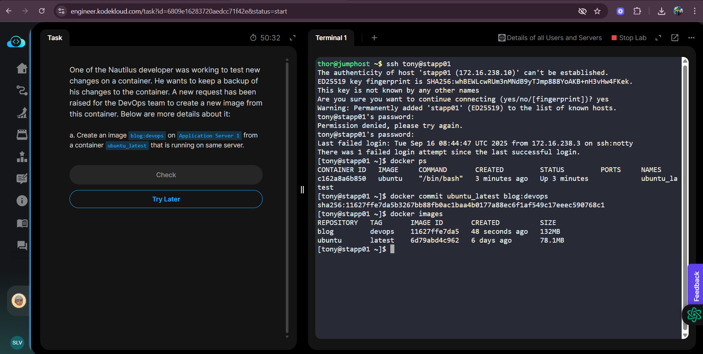

# 🚀 Day 39 Challenge: Create a Docker Image from a Container

## 📌 Task
One of the Nautilus developers was working to test new changes on a container.  
He wants to keep a backup of his changes to the container.  
A new request has been raised for the DevOps team to create a new image from this container.  
 
### Requirement:
- Create an image **blog:devops** on **Application Server 1** from a container **ubuntu_latest** that is running on the same server.


## 🧑‍💻 Beginner-Friendly Basics
### 1. What is a Container?
- A **container** is like a running instance of an image.
- It is similar to a dish prepared from a recipe.

### 2. What is an Image?
- An **image** is a template (recipe) used to create containers.
- Images are read-only, but containers can be modified.

### 3. Why Create an Image from a Container?
- If changes are made inside a container, they will be lost once the container is stopped or removed.
- To save these changes permanently, we create a **new image** from the container.

### 4. Command Used
```bash
docker commit <container_name_or_id> <image_name>:<tag>
```

Example:
```bash
docker commit ubuntu_latest blog:devops
```

---

## 🪜 Step-by-Step Solution

### Step 1: Check running containers
```bash
docker ps
```
- Lists all running containers.  
- Ensure that `ubuntu_latest` is listed.

👉 If not visible, check all containers (including stopped ones):
```bash
docker ps -a
```

---

### Step 2: Commit the container into a new image
```bash
docker commit ubuntu_latest blog:devops
```
Explanation:
- `docker commit` → Saves the state of a container as a new image.  
- `ubuntu_latest` → Container name.  
- `blog:devops` → New image name and tag.

---

### Step 3: Verify the new image
```bash
docker images
```
- Shows all images present on the server.  
- You should see **blog** under `REPOSITORY` and **devops** under `TAG`.

---


---


## ✅ Summary of Commands
```bash
docker ps                                # Check running containers
docker commit ubuntu_latest blog:devops  # Create new image from container
docker images                            # Verify the image
```

---

## 🎯 Key Learning
- **`docker commit`** is used to save container changes into a reusable image.
- This ensures that any modifications made inside a container are not lost when the container stops.

---

